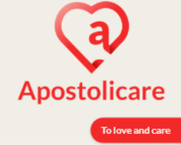
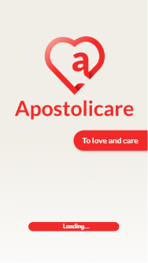

<h1 align="center">
    
</h1>

<h4 align="center">
    🚑 Apostolicare
</h4>

  
  
  

## 📜 Abstract
With the social isolation, many people are weakened by the current world situation in several aspects. Some of these people are having more difficulty to deal with their mental and emotional health in this moment and, unfortunately, cannot count on psychological support or even help from close people due to quarantine. In addition to the existential issue that affects everyone, many are also impacted by the economic scenario in their regions, presenting financial difficulties due to layoffs caused by the crisis or the impossibility of going to work, with closed companies and businesses.

Not only that, but there are also those who want to cooperate with others right now, but find it difficult to do so. In the midst of the distance we are experiencing, the church's action has become slightly limited in terms of individual contact, having a hard time to be in touch and stay close to those who need. There are also people ready to help the most vulnerable ones in the adversities that they may face, attentive to every opportunity they have, to do what they can.

In view of these problems, we thought of a solution to solve them: unite, in a single place, the needy and those who can help. With this objective in mind, we created Apostolicare: an application for people to participate in a community where they can identify themselves as “people who needs help” or “helpers” and, thus, communicate and collaborate with each other.
